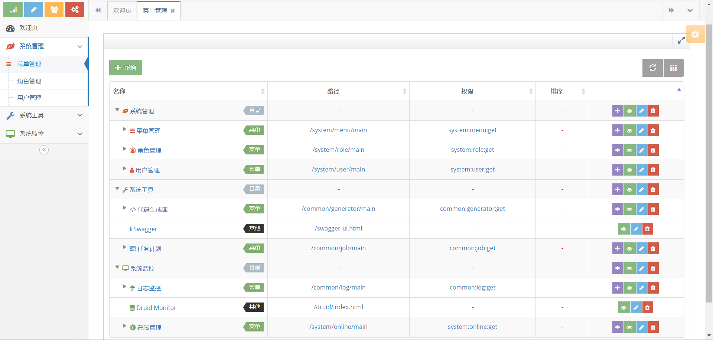

# webboot
Admin管理后台（基于SpringBoot的学习及二次开发框架）

### 基本功能
1. 菜单管理  
2. 角色管理  
3. 用户管理  
4. 代码生成器  
5. Swagger  
6. 任务计划  
7. 日志管理  
8. Druid Monitor  
9. 在线管理  

### 技术选型
- 后端技术选型  
[Spring Boot](https://github.com/spring-projects/spring-boot) (核心框架) [@](http://spring.io/projects/spring-boot)  
[Apache Shiro](https://github.com/apache/shiro) (安全框架) [@](http://shiro.apache.org)  
[MyBatis](https://github.com/mybatis/mybatis-3) (数据库持久层框架) [@](http://www.mybatis.org/mybatis-3)  
[Druid](https://github.com/alibaba/druid) (数据库连接池) [@]()  
[Mybatis-PageHelper](https://github.com/pagehelper/Mybatis-PageHelper) (Mybatis分页插件) [@]()  
[Redis]() (NoSql) [@](https://redis.io)  
[Logback](https://github.com/qos-ch/logback) (日志框架) [@](https://logback.qos.ch)  
[Swagger](https://github.com/swagger-api) (文档生成工具) [@](https://swagger.io)  
[Thymeleaf](https://github.com/thymeleaf) (模板引擎) [@](https://www.thymeleaf.org)  
[Quartz](https://github.com/quartz-scheduler/quartz) (作业调度框架) [@](http://www.quartz-scheduler.org)  
[Apache POI](https://github.com/apache/poi) (Microsoft Office格式文档的操作) [@](http://poi.apache.org/)  
- 前端技术选型  
[jQuery](https://github.com/jquery/jquery) (JS代码库) [@](http://jquery.com)  
[Bootstrap](https://github.com/twbs/bootstrap) (前端开发框架) [@](http://www.bootcss.com)  
[Bootstrap Table](https://github.com/wenzhixin/bootstrap-table) (表格组件) [@](http://bootstrap-table.wenzhixin.net.cn)  
[Bootbox](https://github.com/makeusabrew/bootbox) (提示插件) [@](http://bootboxjs.com)  
[Toastr](https://github.com/CodeSeven/toastr) (通知插件) [@](http://www.toastrjs.com)  
[BootstrapValidator](https://github.com/nghuuphuoc/bootstrapvalidator) (表单验证插件) [@](https://formvalidation.io)  
[zTree_v3](https://github.com/zTree/zTree_v3) (jQuery树插件) [@](http://www.treejs.cn/v3/main.php)  
[layer](https://github.com/sentsin/layer) (弹出层) [@](http://layer.layui.com)  
[layDate](https://github.com/sentsin/laydate) (日期和时间组件) [@](http://www.layui.com/laydate)  
- 推荐模板  
[Ace Admin](http://ace.jeka.by) (当前使用) [@](http://ace.jeka.by)  
[AdminLTE](https://github.com/almasaeed2010/AdminLTE) (基于 bootstrap) [@](https://adminlte.io)  
[Element](https://github.com/ElemeFE/element) (饿了么前端 - 桌面端) [@](http://element.eleme.io)  
[Mint Ui](https://github.com/ElemeFE/mint-ui) (饿了么前端 - 移动端) [@](http://mint-ui.github.io/#!/en)  
[vue-element-admin](https://github.com/PanJiaChen/vue-element-admin) (基于 vue 和 element) [@](https://panjiachen.github.io/vue-element-admin/#/dashboard)  
[VUX](https://github.com/airyland/vux) (一个凑合的 Vue.js 移动端 UI 组件库) [@](https://vux.li)  
